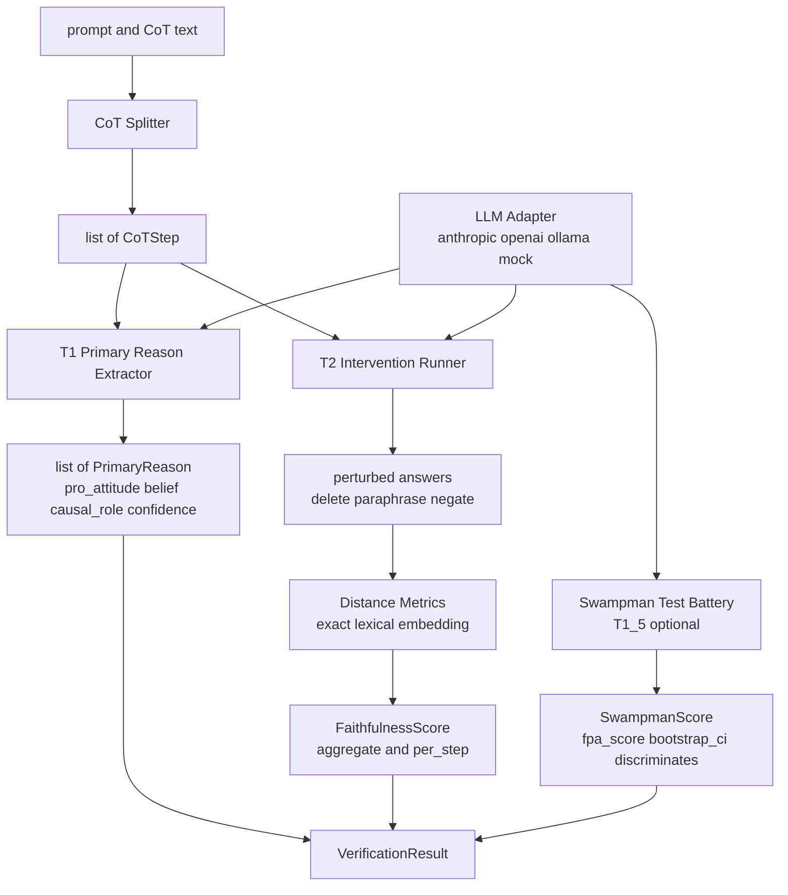

# primary-reason

[](https://github.com/hinanohart/primary-reason/actions/workflows/ci.yml)

**Davidson primary-reason verifier for LLM chain-of-thought** — MIT — Python 3.11+

`primary-reason` is a model-agnostic Python library that probes whether a language model's
chain-of-thought (CoT) actually behaves like a Davidsonian *primary reason* — a (pro-attitude,
belief, causal-role) triple in the sense of Donald Davidson's "Actions, Reasons, and Causes"
(1963) — or just a fluent post-hoc rationalisation.

> Methodological hedge: these are philosophical *analogues* of Davidsonian concepts applied to
> LLM behaviour. The library does not claim to verify intentionality, first-person authority,
> or causal history in any realist sense. Read every output through that frame.

---

## Architecture overview



---

## Why this exists

Four projects in 2025-2026 measure CoT faithfulness or rationalisation audit
(FaithCoT-Bench, C2-Faith, Lie to Me, Project Ariadne). None of them route the analysis
through Davidson's account of action explanation, none of them ship a Swampman-style
ablation. `primary-reason` adds:

1. **Davidson primary-reason decomposition** — every CoT step is decomposed into a
   (pro-attitude, belief, causal-role, confidence) tuple. The pro-attitude / belief split is
   what distinguishes Davidson's account from a unitary "intent" or "goal" notion.
2. **Counterfactual faithfulness** with three intervention families — delete, paraphrase,
   negate — and three distance metrics (exact / lexical / embedding). Follows the spirit of
   FRIT and Hase & Potts CST, but exposes the intervention layer as a first-class API.
3. **Swampman Test Battery (T1.5, minimal)** — contrasts a "causal history" role-prompt
   variant against a "no history" variant, with a *control baseline* and *sentinel-word filter*
   so prefix-echoing alone cannot inflate the score. Bootstrap 95% CI for discrimination.
4. **Model-agnostic by construction** — anthropic / openai / ollama / mock adapters via a
   small `Protocol`. Add your own provider in ~80 lines.

---

## Install

> PyPI trusted-publisher provisioning is in progress; until v0.1.x is on PyPI, install from the
> GitHub Release wheel or from source:

```bash
# from a tagged release wheel (recommended)
pip install https://github.com/hinanohart/primary-reason/releases/download/v0.1.1/primary_reason-0.1.1-py3-none-any.whl

# or from source
pip install "git+https://github.com/hinanohart/primary-reason@v0.1.1"
```

Optional extras (same syntax with the extras suffix, e.g. ``...whl[ollama]`` or
``...primary-reason@v0.1.1#egg=primary-reason[ollama]``):

| Extra | Purpose |
|-------|---------|
| `ollama` | local inference |
| `langfuse` | observability plugin |
| `embeddings` | embedding distance via `sentence-transformers` |
| `bench` | `datasets` + `pandas` for benchmarks |

---

## Quickstart (library)

```python
from primary_reason import ReasonCauseVerifier

verifier = ReasonCauseVerifier(
    model="claude-opus-4-7",
    adapter="anthropic",
    intervention_strategies=("delete", "paraphrase"),
    distance_metric="lexical",
)

result = verifier.verify(
    prompt="If a train leaves at 9:00 and the trip takes 2h 30m, when does it arrive?",
    cot="1. The train leaves at 9:00.\n2. 9:00 + 2:30 = 11:30.\n3. So it arrives at 11:30.",
)

print(result.faithfulness.score)        # aggregate faithfulness in [0, 1]
print(result.primary_reasons)           # list of (pro_attitude, belief, causal_role, confidence)
print(result.faithfulness.per_step)     # per-step causal-effect dict
```

## Quickstart (CLI)

```bash
primary-reason verify "What is 17 * 4?" \
    --cot "1. 17 * 4 = 17 * 2 * 2.\n2. 17 * 2 = 34.\n3. 34 * 2 = 68." \
    --adapter anthropic --model claude-opus-4-7

primary-reason extract "task prompt" --cot "@trace.txt"

primary-reason stb --adapter anthropic --model claude-opus-4-7
```

---

## How it works

**Step 1 — Split**: The input CoT string is parsed by a regex-based splitter into a list of
`CoTStep` objects (index, text, role).

**Step 2 — T1 Primary Reason Extraction**: Each step is sent to the configured LLM adapter
with a structured prompt. The LLM returns a `PrimaryReason` tuple: `pro_attitude` (what the
model "wants"), `belief` (what it treats as true), `causal_role` (what causal function it
plays), and a `confidence` float.

**Step 3 — T2 Counterfactual Interventions**: Each step is independently perturbed under one
or more strategies (delete / paraphrase / negate). The model re-runs on the modified CoT.
Distance between the original and perturbed answers (exact / lexical / embedding) becomes
the per-step causal contribution. The aggregate `FaithfulnessScore.score` is the mean
cross-step contribution.

**Step 4 — T1.5 Swampman Test Battery (optional)**: Two role-prompt variants
("with causal history" vs. "without") are run on a small task battery. Bootstrap 95% CI
tests whether the model's behaviour discriminates the two conditions. A sentinel-word filter
prevents prefix-echoing from inflating the score.

### Key data types

| Type | Fields |
|------|--------|
| `CoTStep` | `index`, `text`, `role` |
| `PrimaryReason` | `step_index`, `pro_attitude`, `belief`, `causal_role`, `confidence` |
| `FaithfulnessScore` | `score`, `per_step`, `interventions`, `method` |
| `SwampmanScore` | `fpa_score`, `bootstrap_ci`, `discriminates`, `per_task` |
| `VerificationResult` | `steps`, `primary_reasons`, `faithfulness`, `swampman_score` |

---

## Related work and differentiation

| Project | Scope | Davidson? | Library? | STB? |
|---------|-------|-----------|----------|------|
| [FaithCoT-Bench](https://arxiv.org/abs/2510.04040) (ICLR 2026) | benchmark for CoT faithfulness | no | benchmark-only | no |
| [C2-Faith](https://arxiv.org/abs/2603.05167) | counterfactual faithfulness metric | no | metric-only | no |
| [Lie to Me](https://arxiv.org/abs/2603.22582) | LLM unfaithfulness detection | no | research code | no |
| Project Ariadne | causal-model + counterfactual reasoning audit | no | proprietary | no |
| **primary-reason** | Davidson primary-reason + counterfactual faithfulness + Swampman ablation | **yes (as analogue)** | **yes** | **yes (minimal)** |

If you cite FaithCoT-Bench or C2-Faith for the underlying counterfactual idea, please also
cite them when reporting `primary-reason` results — the metric is in the same family.

---

## Limitations

- The library does NOT *verify* intentionality, first-person authority, or causal history.
  It measures behavioural proxies. The Swampman score is gameable by sufficiently fluent
  prefix-echoing; the control baseline blunts the obvious attack but does not eliminate it.
- The Swampman default 5-task battery is **exploratory only**. The ``discriminates`` flag is
  pinned to False unless ``n_trials >= 20``; bootstrap CI on n=5 has no statistical force.
- The default CoT splitter is regex-based and English-leaning. Multi-language or
  heavily-formatted traces (LaTeX math, code blocks) may collapse to a single "step". (As of
  v0.1.1 the numbered-list split is anchored to line starts, so inline numerics inside a step
  no longer break math CoTs.)
- ``cache_dir`` and ``max_concurrency`` on ``ReasonCauseVerifier`` are accepted but not yet
  wired into the request path; persistent caching and parallel intervention execution are
  tracked for v0.2.0.
- The included integration tests use `MockAdapter`. Real-LLM smoke tests are not in CI
  (cost / non-determinism). See `benchmarks/` for reproducible LLM runs.

---

## Roadmap

- v0.1.x: bug-fix only (v0.1.1 = splitter / Swampman statistical / JSON wrap fixes).
- v0.2.0: T3 Deviant Causal Chain Detector (Ward 2024), T4 First-Person Authority audit,
  T5 Basic Action Decomposition, ``diskcache`` persistent cache, ``max_concurrency`` parallel
  intervention execution, Davidson-vs-naive-baseline ablation harness.
- v0.3.0: HuggingFace adapter (local transformers), batch verification API.

---

## Cite

```bibtex
@software{primary_reason_2026,
  title  = {primary-reason: Davidson primary-reason verifier for LLM chain-of-thought},
  author = {hinanohart},
  year   = {2026},
  url    = {https://github.com/hinanohart/primary-reason},
  license = {MIT},
}
```

## License

MIT License. See [LICENSE](LICENSE).
